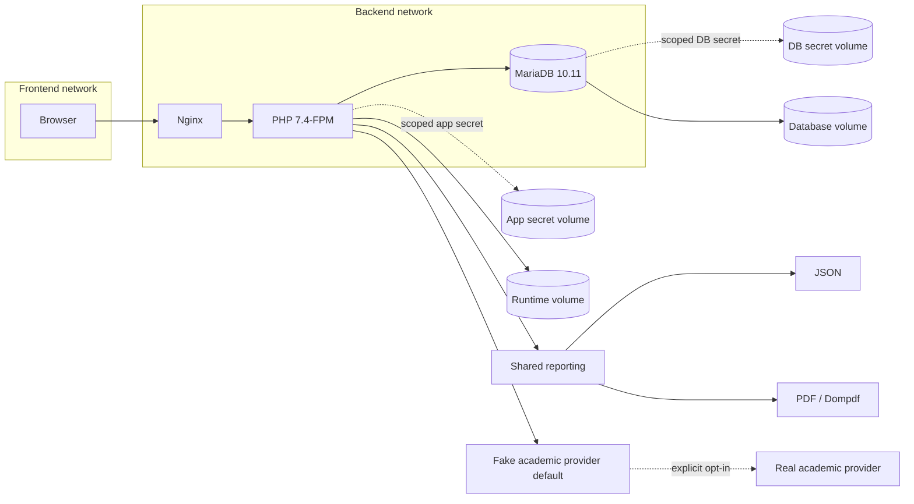
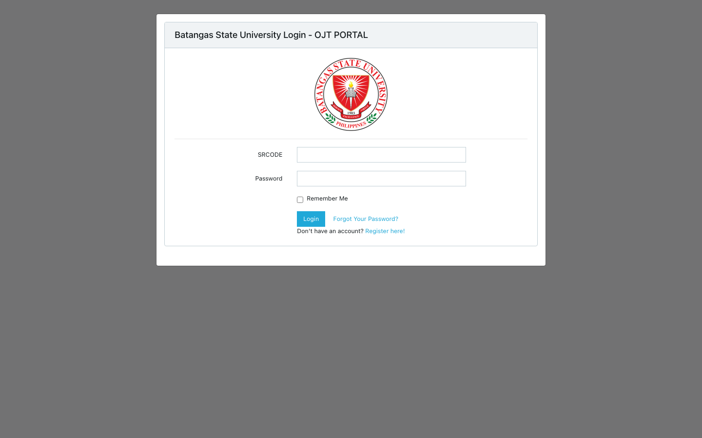
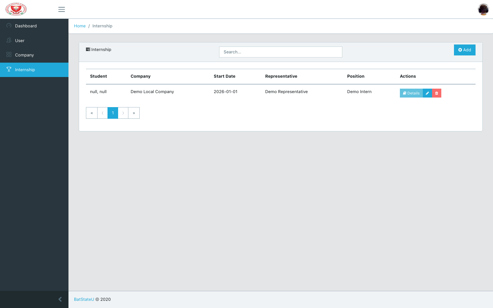
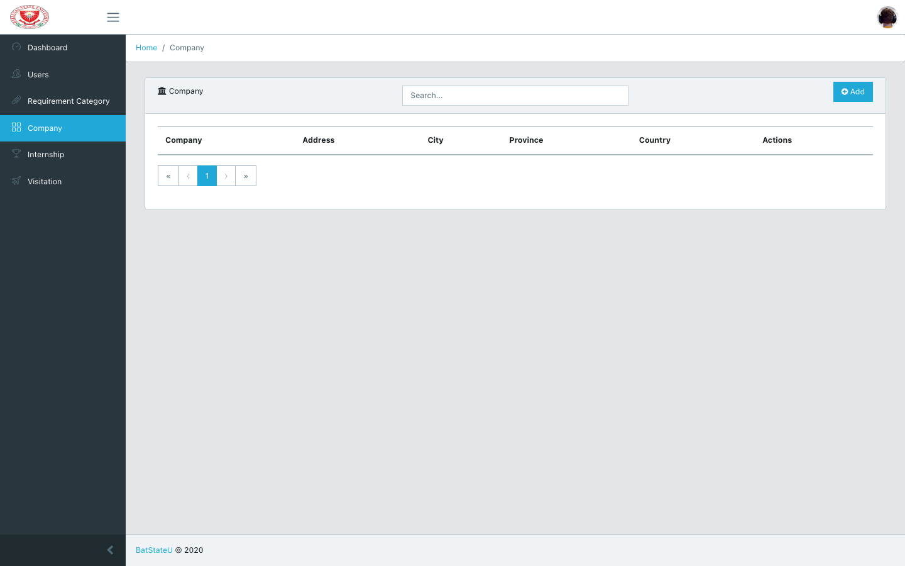

# OJT Tracker Management System

## Project Overview

This repository contains a Laravel monolith for tracking college On-the-Job Training (OJT) placements.

## Current capabilities

- Role-based student, coordinator, and superuser access.
- Placement creation with automatic active requirements.
- Placement descriptions and reports, with authorization and ownership checks.
- Coordinator/superuser verification and validation, transactional approval, and reopen audit events.
- Approved-only internship reporting in JSON and PDF with shared filtering.
- A deterministic fake academic provider for local use; a real provider is explicit opt-in.

## Architecture & Tech Stack

This is a portfolio view of the current, tested deployment shape. It documents **legacy runtime stabilization**, not current supported framework modernization.

**Project status:** Legacy stabilization with a tested local Compose contract; final local happy-flow acceptance is sealed, while framework modernization remains future work.

| Area | Current stack / boundary |
| --- | --- |
| Frontend | React 16 with CoreUI and bundled static assets |
| Web/runtime | Nginx → PHP 7.4-FPM; Laravel 5.7 legacy stabilization |
| Authentication | Laravel Passport |
| Database | MariaDB 10.11 |
| Reporting | Dompdf, with shared reporting data rendered as JSON or PDF |
| Delivery and validation | Docker Compose and fail-fast shell contracts; screenshots were captured with Playwright |
| Academic data | Fake academic provider by default; real provider is explicit opt-in |




## Sample Screenshots

These screenshots show visible application pages without embedding demo credentials, tokens, or personal data; they are not proof of the entire happy flow.

| Login | Student internship page | Coordinator company page |
| --- | --- | --- |
|  |  |  |
| Authentication entry point. | Student internship page showing the placement/evidence surface. | Coordinator company page showing the company management surface. |

## Quick Start with Docker Compose

Requires Docker with Compose. The default setup generates local app/database secrets and synthetic fixtures; no live provider credentials are required.

### Local quality gate

Run the bounded sequential contract suite with:

```sh
sh tests/quality-gate.sh
```

The Ticket10 candidate acceptance command is:

```sh
sh tests/Infrastructure/ticket10_acceptance_test.sh
```

The checked-in browser contract uses the pinned Playwright dependency and the
isolated runner invoked by the acceptance contract; no external test repository
or live provider is required.


```sh
git clone https://github.com/mauricechesteraguda/ojt-tracker-management-system.git
cd ojt-tracker-management-system
docker compose up --build -d
```

Open the app at <http://localhost:8088>. `/healthz` is Nginx edge liveness only; it does not prove that the application is ready. Compose health checks cover MariaDB and PHP-FPM, and the Nginx check also requests `/login` for application readiness.

To reset the local synthetic demo data:

```sh
docker compose exec php-fpm demo-reset
```

Stop the stack cleanly with `docker compose down`; to also remove its local named volumes and generated data, use `docker compose down -v`.

### Demo Accounts

These deterministic, synthetic accounts are local-only demo fixtures. They are non-production credentials: never reuse them in a deployed environment. `demo-reset` recreates the fixture graph deterministically. Do not log these values during validation.

| Role | Synthetic ID | Email | Password |
| --- | --- | --- | --- |
| Student | `DEMO-STUDENT-001` | `demo.student.001@test.example` | `DemoOnly-Student-001!` |
| Coordinator | `DEMO-COORD-001` | `demo.coord.001@test.example` | `DemoOnly-Coord-001!` |
| Superuser | `DEMO-ADMIN-001` | `demo.admin.001@test.example` | `DemoOnly-Admin-001!` |

## Project Structure

app/         # Laravel application code
routes/      # web and API route definitions
resources/   # views and bundled frontend resources
database/    # migrations and seed data
docker/      # Nginx, PHP-FPM, and MariaDB images
tests/       # checked-in validation contracts
docs/        # requirements, changelogs, and screenshots
compose.yaml # local Compose runtime

## API Documentation

Browser login uses Laravel's web authentication at `/login` (with the generated `Auth::routes()` flow). Protected `/api/*` routes use Laravel Passport through the `auth:api` middleware; the academic profile boundary is the unauthenticated, rate-limited exception.

The current API is organized into high-level resource groups rather than the obsolete student/task/evaluation list:

- Users, companies, and clusters: examples include `GET /api/users/{id}` and coordinator/superuser mutations.
- Internships: `POST /api/internships`, `GET /api/internships/{id}`, and lifecycle actions such as `POST /api/internships/{id}/approve` and `/reopen`.
- Evidence: descriptions, requirements, and reports under `/api/descriptions`, `/api/requirements`, and `/api/reports`, with owner and role boundaries.
- Reporting: `POST /api/internships/report` for JSON and `POST /api/internships/report/pdf` for PDF; results are approved-only.
- Academic data: `POST /api/academic/profile` uses the configured fake provider by default.

The checked-in automated validation is fail-fast Compose/shell contract coverage plus the pinned Playwright Ticket10 acceptance stack.

## Contribution

This project is open for collaboration. If you wish to contribute:

    Fork the repository.
    Create a feature branch (git checkout -b feature/your-feature-name).
    Commit your changes (git commit -m 'Add your feature').
    Push to the branch (git push origin feature/your-feature-name).
    Open a pull request.

## Contact

For any questions or inquiries, please reach out to www.linkedin.com/in/agudatech/.

## Support

If you find this project helpful and would like to support its ongoing development, consider buying me a coffee! Your support helps me keep working on this project and developing more features.

[](https://www.buymeacoffee.com/mauriceague)

    
